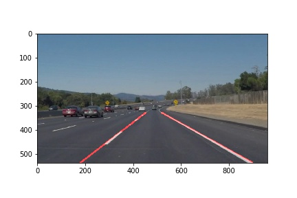

### Finding Lane Lines on the Road

The goals / steps of this project are the following:
* Make a pipeline that finds lane lines on the road

[//]: # (Image References)

[image1]: ./test_images_output/solidYellowCurve.jpg "SolidYellowCurve"

---
### Reflection

### 1. Pipeline stages

My pipeline consisted of 5 steps.
1. Convert image to grayscale.
2. Run Gaussian blur to reduce noise and detail.
3. Detect edges using Canny edge detection.
4. Find point of interest polygon
5. Draw hough lines. 

In order to draw a single line on the left and right lanes, I modified the draw_lines() function by averaging the slopes and intercepts of hough lines of left and right lanes, respectively. Then the extreme points of the point-of-intereset polygon are extroplated to draw the lines.  

### 2. Shortcomings with the current pipeline

The tuning parameters for canny edge detection, hough lines and point-of-interest-polygon are hard-coded, and may not perform satisfactorily under different conditions, such as weather, mounting point of the cameras. 

### 3. Possible improvements to the pipeline

A possible improvement would be to generalize the tuning parameters for each pipeline stage.

Another potential improvement could be to improve the stability of extrapolation in draw_lines function to compute average across different frames/images.  
